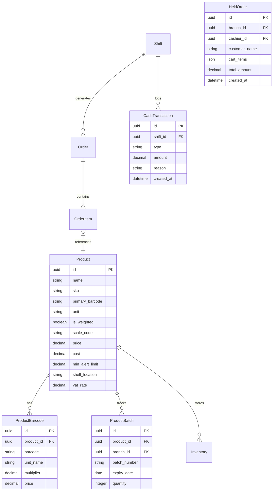

# دليل التحول الهندسي الشامل: تحويل النظام إلى كاشير سوبر ماركت متكامل
**وثيقة التحليل الفني والمعماري لمتطلبات السوبر ماركت ونقاط البيع السريعة (Supermarket POS & Retail System)**

---

## 1. المقدمة والمقارنة الجوهرية (Fashion vs Supermarket)

تم تصميم النظام الحالي في الأساس لخدمة محلات **الملابس والأحذية والكماليات (Fashion & Apparel)**، حيث تتميز هذه التجارة بـ:
- وجود مقاسات وألوان وتصنيفات رجالي/حريمي/أطفال.
- عدد مبيعات قليل نسبياً في الدقيقة (Transaction throughput منخفض).
- تتبع القطع بالسيريال الفردي الدقيق المطبوع داخلياً.

أما **السوبر ماركت والماركت الاستهلاكي (FMCG - Fast-Moving Consumer Goods)** فله طبيعة عمل ومعمارية مختلفة تماماً:

| وجه المقارنة | النظام الحالي (Fashion Retail) | المطلوب لنظام السوبر ماركت (Supermarket POS) |
|:---|:---|:---|
| **طبيعة المخزون** | قطع محددة بأرقام تسلسلية فريدة (`ProductSerial`) | أصناف بالكمية الإجمالية (`Bulk / Quantity-based`) بآلاف القطع |
| **الباركود** | توليد باركود داخلي مخصص للنظام | دعم باركودات المصنع الدولية المطبوعة مسبقاً (EAN-13, EAN-8, UPC) |
| **سرعة الكاشير** | اختيار السيريال ومراجعة القطعة (15-30 ثانية لكل صنف) | مسح باركود فوري بصوت الـ Beep (أقل من نصف ثانية لكل صنف) |
| **وحدات القياس** | قطعة فقط (مع مقاس ولون) | متعددة: بالقطعة، بالكرتونة، بالوزن (كيلو / جرام)، باللتر |
| **أصناف الميزان** | غير مدعومة نهائياً | فك تشفير باركود الميزان الإلكتروني (وزن وسعر مشفر داخل الباركود) |
| **صلاحية المنتجات** | لا تنتهي صلاحيتها | تتبع تواريخ انتهاء الصلاحية والدفعات (Expiry Dates & Batches) |
| **سير الفاتورة** | فاتورة هادئة لا تقبل التعليق | دعم تعليق واسترجاع الفواتير السريع (Hold / Resume Cart) |
| **العروض والتخفيضات** | خصم نسبة مئوية أو كاشير | عروض معقدة: (اشتر 2 واحصل على 1 مجاناً، عبوة توفيرية، نقاط ولاء) |

---

## 2. ما ينقص النظام الحالي (الفجوات الفنية الإلزامية)

### أولاً: إلغاء اشتراط السيريالات في البيع (Core Transaction Overhaul)
- **الوضع الحالي:** كود الفاتورة في [`orders.controller.js:57`](file:///c:/Users/HP/Desktop/daydream-backend-main/controllers/orders.controller.js#L57) يرفض حفظ أي صنف لا يحتوي على مصفوفة `serialIds`.
- **المطلوب:**
  - تحويل الصنف إلى `productId` و `quantity` مباشرة.
  - خصم الكمية المباعة مباشرة من جدول `inventories.quantity`.
  - السماح بمسح نفس الصنف أكثر من مرة تلقائياً دون تكرار الأسطر (Auto-increment quantity in cart).

---

### ثانياً: إعادة هيكلة جدول المنتجات (Product Schema Clean-up)
- **الوضع الحالي:** يحتوي جدول `products` على حقول: `size`, `shoeSize`, `color`, `gender`.
- **المطلوب إضافته:**
  1. `unit`: وحدة الصنف الأساسية (`piece` قطعة، `kg` كيلو، `gram` جرام، `pack` باكت، `box` كرتونة).
  2. `isWeighted`: علامة لتحديد هل الصنف يوزن بميزان أم يباع بالعدد.
  3. `scaleCode`: كود الصنف المختصر في ميزان الباركود (PLU Code).
  4. `minAlertLimit`: حد الطلب الأدنى للتنبيه عند نقص الصنف في الرف.
  5. `shelfLocation`: موقع الصنف في السوبر ماركت (مثال: A3, الرف 2).
  6. `vatRate`: نسبة ضريبة القيمة المضافة الخاصة بالصنف (14% خاضع، أو 0% معفى للسلع الأساسية).

---

### ثالثاً: دعم باركود الميزان الإلكتروني (Scale Barcode Parser)
في السوبر ماركت، الميزان الإلكتروني في قسم الجبن أو الخضار يطبع ستيكر بباركود قياسي دولي (Type 20 / 21) مثل:
```text
20 01234 00450 8
│   │     │    └─ Check digit
│   │     └────── الوزن (450 جرام = 0.450 kg)
│   └──────────── كود الصنف (PLU: 01234 - جبنة رومي)
└──────────────── بادئة باركود الميزان (تبدأ دائماً بـ 20 أو 21)
```
- **ما ينقص:** دالة ذكية داخل مسار البحث والمسح `GET /pos/scan` تفحص إذا كان الباركود يبدأ بـ `20` أو `21`، وتقوم آلياً باستخراج كود الصنف وحساب الوزن بدقة وإضافته للفاتورة.

---

### رابعاً: باركودات متعددة ووحدات بيع مختلفة لنفس الصنف (Multi-Barcode & Multi-Unit)
- علبة التونة يمكن أن تُباع:
  - علبة مفردة = 40 جنيه (لها باركود المصنع).
  - كرتونة 24 علبة = 900 جنيه (لها باركود الكرتونة الخارجي، وتخصم 24 علبة من المخزن).
- **ما ينقص:** جدول وسيط `product_barcodes`:
  - `barcode`: الباركود الدولي أو باركود الكرتونة.
  - `productId`: المنتج.
  - `unitName`: اسم الوحدة (قطعة / كرتونة).
  - `multiplier`: معامل التحويل (الكرتونة = 24 قطعة).
  - `price`: سعر البيع الخاص بهذه الوحدة.

---

### خامساً: تتبع تواريخ الصلاحية والدفعات (Expiry Tracking & Batches)
- الألبان، الزبادي، واللحوم لا يمكن بيعها أو تخزينها بدون معرفة تاريخ الصلاحية.
- **ما ينقص:**
  - جدول `product_batches`:
    - `batchNumber`: رقم الدفعة.
    - `expiryDate`: تاريخ انتهاء الصلاحية.
    - `quantity`: الكمية المتاحة من هذه الدفعة.
  - شاشة تقارير بالأصناف التي تنتهي صلاحيتها خلال (7 أيام / 30 يوماً).
  - منع الكاشير من بيع صنف منتهي الصلاحية مع إظهار تنبيه فوري.

---

### سادساً: تعليق واسترجاع الفواتير (Hold / Resume Cart)
- سيناريو متكرر يومياً: زبون أمام الكاشير نسي إحضار علبة مناديل وذهب لجلبها؛ الطابور سيتعطل بالكامل!
- **ما ينقص:**
  - جدول أو ذاكرة وسيطة للفواتير المعلقة `held_orders`.
  - مسار `POST /orders/hold`: يحفظ السلة الحالية مع اسم أو رقم للعميل ويفرغ الشاشة.
  - مسار `GET /orders/held`: يعرض قائمة الفواتير المعلقة.
  - مسار `POST /orders/resume/:id`: يسترجع الفاتورة فوراً لمتابعة الحساب والطباعة.

---

### سابعاً: إدارة النقدية والمصروفات بالشيفت (Petty Cash & Drawer Management)
- شيفت الكاشير في السوبر ماركت يحتاج رقابة مشددة:
  - **العهدة الافتتاحية (Opening Float):** تسجيل مبلغ الفكة الذي يبدأ به الكاشير في الدرج.
  - **المصروفات النثرية (Cash Drop / Petty Cash):** إثبات خروج نقدية من الدرج (شراء أكياس، دفع فاتورة، توريد للإدارة).
  - **تسوية نهاية الشيفت (Blind Shift Settlement):** إدخال الكاشير لما عده في الدرج، ومطابقته آلياً مع مبيعات النظام واستخراج تقرير العجز أو الزيادة (Shortage / Overage).

---

## 3. إضافات نوعية ومميزات تجعل السيستم احترافياً ومنافساً (Value-Added Features)

إذا أردت أن يكون السيستم في مستوى البرامج الكبرى مثل **Odoo POS, Foodics, NCR**:

### 1. شاشة الأصناف المفضلة السريعة (Quick Touch Favorites)
- أصناف ليس عليها باركود أو يصعب مسحها باستمرار:
  - رغيف عيش، بيضة، كيس بلاستيك، كوز ذرة.
- توفير أزرار لمس سريعة على الشاشة بصور المنتجات ليضغط عليها الكاشير بلمسة واحدة.

### 2. محرك العروض والترويج (Promotions Engine)
- **عرض الكميات (Mix & Match / Bundle):** اشتري 3 قطع بسعر 20 بدل 25.
- **عرض الصنف الإضافي (Buy X Get Y Free):** اشتري 2 زبادي واحصل على 1 مجاناً.
- **ساعات التخفيض (Happy Hours):** تخفيض 10% على المخبوزات بعد الساعة 10 مساءً.

### 3. ربط حسابات الآجل ودَفتر العملاء الدائمين (Customer Credit Accounts / الشكك)
- في الأحياء السكنية والقرى، كثير من العملاء يشترون بالآجل ويسددون أول الشهر.
- إمكانية فتح "حساب آجل" للعميل بحد ائتماني أقصى، وطباعة كشف حساب بالمشتريات والمدفوعات.

### 4. دعم الفاتورة والإيصال الإلكتروني المصري (ETA e-Receipt Integration)
- الربط مع منظومة الإيصال الإلكتروني التابعة لمصلحة الضرائب المصرية (B2C e-Receipt) عبر جهاز POS معتمد أو API رسمي.

### 5. التوافق مع العتاد الصلب (Hardware Integrations)
- **طابعات الفواتير الحرارية (ESC/POS 80mm):** توليد أوامر الطباعة السريعة مع دعم القص التلقائي للورق والطباعة بدون حوار المتصفح.
- **فتح درج النقدية التلقائي (Cash Drawer Trigger):** إرسال نبضة كهربائية للدرج ليفتح تلقائياً فور إنهاء الفاتورة النقدية.
- **شاشة عرض العميل (Customer Facing Display):** شاشة صغيرة يرى فيها المشتري اسم كل صنف وسعره والإجمالي أثناء المسح.

---

## 4. التصميم الهندسي المقترح للجداول المضافة (Database Schema Design)



---

## 5. خطة العمل التنفيذية للتحويل (Action Roadmap)

نوصي بتقسيم التحويل إلى **4 مراحل تنفيذية متتالية**:

### 🎯 المرحلة الأولى: تحويل الفاتورة إلى البيع السريع بالباركود والكمية (3-4 أيام)
1. تعديل مسار `POST /api/v1/orders` لقبول `productId` و `quantity` مباشرة بدون اشتراط `serialIds`.
2. خصم الكميات مباشرة من جدول `inventories`.
3. تعديل مسار البحث السريع `GET /api/v1/pos/scan?barcode=...` للرد الفوري باسم الصنف وسعره ومخزونه في أقل من 50 مللي ثانية.
4. السماح بتكرار نفس الصنف في نفس الفاتورة مع جمع الكميات تلقائياً.

### 🎯 المرحلة الثانية: تعديل بيانات المنتجات ودعم الميزان (3-5 أيام)
1. إضافة حقول `unit`, `isWeighted`, `scaleCode`, `minAlertLimit` لجدول `products`.
2. تنظيف حقول الملابس القديمة (`size`, `shoeSize`, `color`, `gender`) وجعلها اختيارية غير ملزمة.
3. بناء دالة فك تشفير باركود الميزان (Scale Barcode Parser) لقراءة أصناف الجبن واللحوم والخضار تلقائياً.
4. إنشاء جدول `product_barcodes` لدعم الباركودات المتعددة ووحدات الكرتونة والقطعة.

### 🎯 المرحلة الثالثة: ميزات الكاشير المتقدمة والشيفت (4-5 أيام)
1. إنشاء نظام تعليق واسترجاع الفواتير (`HeldOrder` CRUD).
2. تعزيز نظام الشيفتات (`shifts`):
   - تسجيل الفكة الافتتاحية (Opening Float).
   - سحب وإيداع النقدية النثرية (Petty Cash Movements).
   - الجرد النهائي للمبيعات وطباعة تقرير الـ Z-Report للشيفت.
3. دعم طباعة الفاتورة السريعة بتنسيق ESC/POS الحراري (80mm).

### 🎯 المرحلة الرابعة: تواريخ الصلاحية والعروض (5-7 أيام)
1. بناء جدول الدفعات وتواريخ الصلاحية `product_batches`.
2. تنبيهات الأصناف المنتهية والصالحة للبيع.
3. بناء محرك العروض والخصومات المركبة (Buy X Get Y).
4. نظام حسابات الآجل والشكك للعملاء الدائمين.

---

## 6. الخلاصة والتوصية
النظام الحالي يتمتع بأساس قوي ومستقر (Security, Authentication, Logging, Robust Transactions, Multi-Branch). الخطوة المنطقية ليست إعادة كتابته من الصفر، بل **تطوير مسار البيع ليدعم الكمية والباركود الدولي أولاً**، ثم التوسع التدريجي في ميزات السوبر ماركت التخصصية.
